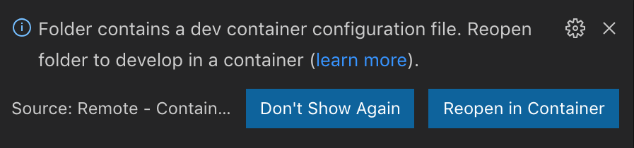

# Go RESTful

A real world production-grade RESTful proof-of-concept project.

## Objectives

- An optimized Go implementation follows clean architecture, provides mechanism to declare entities, use cases - - and external services (e.g. data access).

- An optimized Go implementation provides mechanism to exposes entities and use cases as RESTful web services.

- An optimized Go implementation of token-based authentication and authorization.

- An optimized Go implementation provides abstract mechanism to access relational databases.

- An optimized Go development environment with Git, Docker, Golang/dep, Golang debuggers (GDB/Delve) and editors (VSCode/GoLand).

- A scalable and highly available production deployment solution over AWS cloud using Terraform.

- An optimized staging environment replicating production environment for testing purposes.

- An optimized CI/CD solution with CircleCI and AWS.

- An optimized issues tracking mechanism with Github projects, issues and pull requests.

- Continual improvements.

## Issues Tracking

[](https://github.com/the-evengers/go-restful/projects/1)
[](https://github.com/the-evengers/go-restful/issues) [](https://github.com/the-evengers/go-restful/issues?q=is%3Aissue+is%3Aclosed) [](https://github.com/the-evengers/go-restful/pulls) [](https://github.com/the-evengers/go-restful/pulls?q=is%3Apr+is%3Aclosed)

This project use Github project, issues and pull requests to manage and track issues. Refer to [this Github project](https://github.com/the-evengers/go-restful/projects/1) for further details.

## Development

### Requirements

Local development machines need to have following tools installed and working properly:

- [Docker](https:://www.docker.com) for running a full-time containerized development environment.

- [Visual Studio Code](https://code.visualstudio.com) with [Remote - Containers extension](https://marketplace.visualstudio.com/items?itemName=ms-vscode-remote.remote-containers) for writing code with Intellisense, running and debugging code within containers.

Windows users need to additionally have an Unix-shell emulator to be able to run utility scripts ([Git Bash](https://gitforwindows.org) is recommended).

### Usage

#### With Visual Studio Code

With all of above requirements fullfiled, developers can experience a full-time local-quality VSCode-powered containerized development environment by just opening the repository in VSCode container mode.

To open the repository in VSCode (after cloning the repository into local development machines), developers can either:

- Issue following command (with VSCode command line tool added to `PATH`):

``` shell
code /path/to/this/repository
```

- Or open the repository using VSCode graphical user interface:

  - Select *File* → *Open* → *Browse The Repository*.

  - Or use default keyboard shortcut: *Command* + *O* (or *Ctrl* + *O* on Windows).

Once the repository is opened, as the repository includes `.devcontainer.json`, VSCode will automatically ask you to reopen in container mode.



Just select *Reopen in Container*, or if you've already opened the project in local mode and don't see the above prompt, you can issue the VSCode command (*View* → *Command Pallete* or press *F1*) *Remote-Containers: Reopen in Container* to achieve the same effect.

For the first open, VSCode will automatically build an image based on `.devcontainer.json` and `Dockerfile`, the process may take a while. Latter opens will reuse the prebuilt image.

Once the image was built successfully, VSCode will launch a container from that image and start setting up some essential stuff for it to work. After that, you're now connected to the container within your VSCode client, you can use every features of VSCode as is.

- You can start writing code with Intellisense support.

- You can run and debug the application by either selecting *Debug* → *Start Debugging* or using default keyboard shortcut *F5*.

Note that the local workspace will be mounted to `/go/src/github.com/the-evengers/go-restful` within the container.

#### Without Visual Studio Code

Without VSCode, developers will not be able to achieve a full-time local-quality VSCode-powered containerized development environment. However, if there's any reason that you can not or do not want to work with Visual Studio Code, you can still start a containerized development environment and start working on that or even build your own development solution on top of that.

To start the development container, issue following command:

``` shell
./scripts/start-devcontainer.sh
```

For the first run, the script will build an image based on `Dockerfile`, the process may take a while. Latter runs will reuse the prebuilt image.

Once the image was built successfully, it will launch a container in interactive mode and mount the repository's root directory to `/go/src/github.com/the-evengers/go-restful` within the container, so that developers can make changes to the repository locally and have those changes automatically reflected into the container.

In interactive mode within the container, developers can issue every `go` CLI commands, e.g:

``` shell
# To start the application.
go run main.go
```

### License

[](https://github.com/the-evengers/go-restful/blob/master/LICENSE) 

Copyright © The Evengers. All rights reserved.

This project is licensed under the [Apache License 2.0](https://github.com/the-evengers/go-restful/blob/master/LICENSE) and is available for free.
