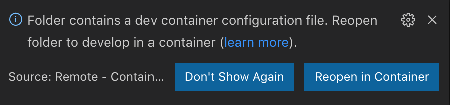

## Development with Visual Studio Code

With all of [those requirements](/README.md#requirements) fullfiled, developers can experience a full-time local-quality VSCode-powered containerized development environment by just opening the repository in VSCode container mode.

To open the repository in VSCode (after cloning the repository into local development machines), developers can either:

- Issue following command (with VSCode command line tool added to `PATH`):

``` shell
code /path/to/this/repository
```

- Or open the repository using VSCode graphical user interface:

  - Select *File* → *Open* → *Browse The Repository*.

  - Or use default keyboard shortcut: *Command* + *O* (or *Ctrl* + *O* on Windows).

Once the repository is opened, as the repository includes `.devcontainer.json`, VSCode will automatically ask you to reopen in container mode.



Just select *Reopen in Container*, or if you've already opened the project in local mode and don't see the above prompt, you can issue the VSCode command (*View* → *Command Pallete* or press *F1*) *Remote-Containers: Reopen in Container* to achieve the same effect.

For the first open, VSCode will automatically build an image based on `.devcontainer.json` and `Dockerfile`, the process may take a while. Latter opens will reuse the prebuilt image.

Once the image was built successfully, VSCode will launch a container from that image and start setting up some essential stuff for it to work. After that, you're now connected to the container within your VSCode client, you can use every features of VSCode as is.

- You can start writing code with Intellisense support.

- You can run and debug the application by either selecting *Debug* → *Start Debugging* or using default keyboard shortcut *F5*.

Note that the local workspace will be mounted to `/go/src/github.com/the-evengers/go-restful` within the container.
